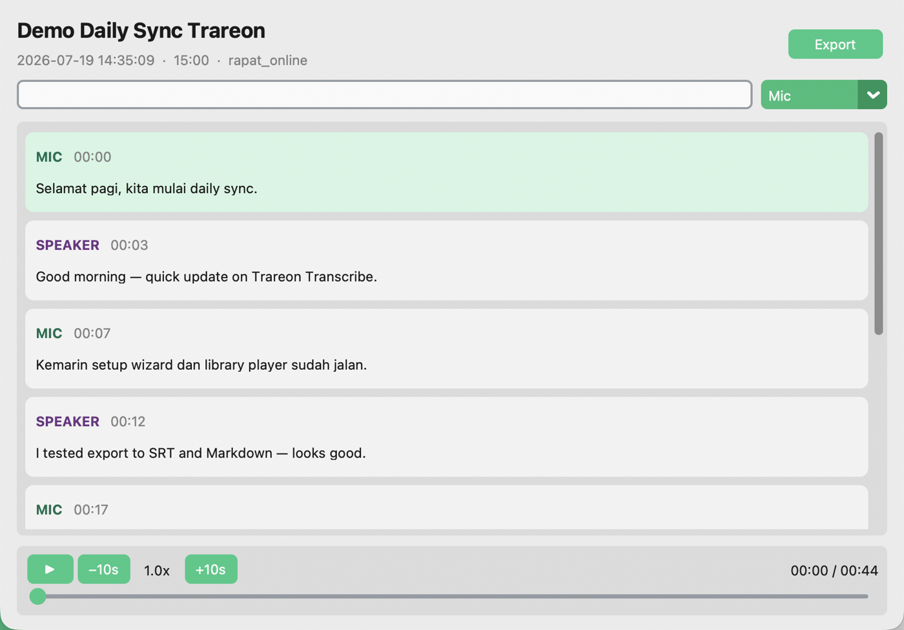
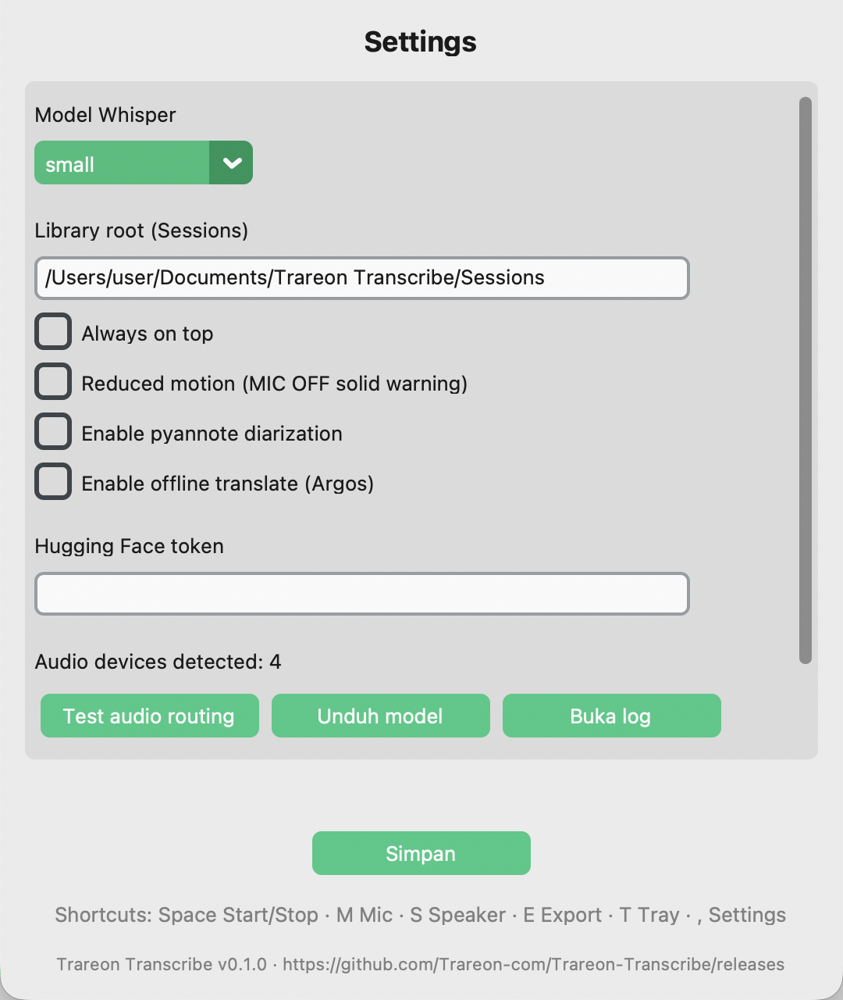
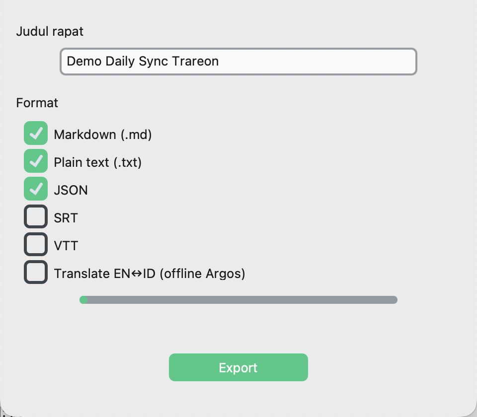

<p align="center">
  
</p>

<h1 align="center">Trareon Transcribe</h1>

<p align="center">
  <strong>Offline live transcription</strong> for meetings — mic + system audio,<br>
  powered by local Whisper. Your audio never leaves the machine.
</p>

<p align="center">
  <a href="https://github.com/Trareon-com/Trareon-Transcribe/releases"></a>
  <a href="https://github.com/Trareon-com/Trareon-Transcribe/actions/workflows/ci.yml"></a>
  
  
  
</p>

<p align="center">
  <a href="#download">Download</a> ·
  <a href="#gallery">Gallery</a> ·
  <a href="#features">Features</a> ·
  <a href="#quick-start">Quick start</a> ·
  <a href="#audio-routing">Audio routing</a> ·
  <a href="#troubleshooting">Troubleshooting</a>
</p>

---

## Why Trareon Transcribe?

| | |
|---|---|
| **Private by default** | STT runs on-device via whisper.cpp. No cloud ASR in the product path. |
| **Mic + speaker** | Capture both sides of Zoom / Meet / Teams (or room mic only). |
| **Meeting-ready** | Live captions, Library player, export to MD / TXT / JSON / SRT / VTT. |
| **Crash-safe** | Autosave + resume for interrupted sessions. |

---

## Download

Prebuilt apps are on **[GitHub Releases](https://github.com/Trareon-com/Trareon-Transcribe/releases)** (not committed to git).

| Asset | Platform |
|-------|----------|
| `Trareon-Transcribe-*-macos-arm64.zip` | Mac Apple Silicon (M1–M4) |
| `Trareon-Transcribe-*-macos-x64.zip` | Mac Intel |
| `Trareon-Transcribe-*-windows-x64.zip` | Windows 10 / 11 |

**macOS** — unzip → move `Trareon Transcribe.app` to Applications → open.  
If Gatekeeper blocks: right-click → **Open**, or System Settings → Privacy & Security → **Open Anyway**.  
Whisper models download on first-run wizard (internet once).

**Windows** — unzip → run `TrareonTranscribe.exe`. Allow microphone access when prompted. For speaker capture, install [VB-Cable](https://vb-audio.com/Cable/).

> Builds are unsigned. A first-launch “unidentified developer” warning on macOS is expected until notarization is added.

---

## Gallery

Screenshots below use **seeded demo data** (bilingual meeting captions) so you can see the real UI without a live recording.

### Main window — light

Live captions with MIC/SPK labels, VU meters, confidence, CPU/RAM/GPU HUD, font size & Clear.


### Main window — dark

Theme toggle persists across sessions.


### Setup wizard

Detects CPU / RAM / **GPU**, recommends a Whisper model, installs helpers, downloads models, optional HF token, tone-test.


### Library

Session history with **storage usage** (GB used / free). Open, rename, export, or delete.


### Transcript player

Synced playback of mic/speaker WAV with speaker · timestamp · text (as recorded — no auto-translate).



### Settings

Model catalog, library path, always-on-top, pyannote / Argos options, HF token (OS keyring), tone-test, open logs/cache.



### Export

Markdown, TXT, JSON, SRT, VTT written into the session folder.



---

## Features

| Feature | Detail |
|---------|--------|
| Offline STT | whisper.cpp (ggml) — tiny → large |
| Dual stream | Mic + speaker / loopback in parallel |
| Meeting modes | Webinar · Rapat Online · Rapat Offline |
| Dual VAD | WebRTC + Silero |
| Echo-dedupe | Reduces self-echo on Rapat Online |
| Diarization | Per-source MIC/SPK; optional pyannote |
| Library player | Seek, speed, highlight active segment |
| Export | WAV tracks + MD / TXT / JSON / SRT / VTT |
| Tray | Keep capturing while sharing a screen |
| Single-instance | One app process at a time |

### Whisper models (offline)

| Model | Size | RAM | Speed | Quality |
|-------|------|-----|-------|---------|
| `tiny` | ~75 MB | ~1 GB | Very fast | Low |
| `base` | ~150 MB | ~1 GB | Fast | Medium |
| `small` | ~500 MB | ~2 GB | Medium | Good |
| `medium` | ~1.5 GB | ~5 GB | Slow | High |
| `large-v3-turbo` | ~1.6 GB | ~4 GB | Medium | Very high |
| `large` | ~3 GB | ~8 GB | Slowest | Best |

---

## Quick start

### End users

1. Download the zip for your OS from [Releases](https://github.com/Trareon-com/Trareon-Transcribe/releases).
2. Launch the app → complete the setup wizard.
3. Configure [audio routing](#audio-routing) → run **Tone Test**.
4. Pick a meeting mode → **Start**.

### Developers

```bash
# macOS needs Tk as a separate Homebrew formula
brew install python@3.11 python-tk@3.11

git clone https://github.com/Trareon-com/Trareon-Transcribe.git
cd Trareon-Transcribe
python3.11 -m venv .venv
source .venv/bin/activate          # Windows: .venv\Scripts\activate
pip install -r requirements.txt

# Preferred on macOS (Dock / mic dialog = “Trareon Transcribe”)
chmod +x scripts/run_mac_app.sh
./scripts/run_mac_app.sh

# Demo UI with dummy Library sessions
./scripts/run_mac_app.sh --demo
```

```bash
pip install -r requirements-dev.txt
pytest -q
TRAREON_NO_RELAUNCH=1 python scripts/capture_screenshots.py   # refresh README gallery
```

### First-run wizard checklist

1. Confirm detected CPU / RAM / GPU and the suggested model.
2. Install BlackHole + ffmpeg (macOS) or follow VB-Cable guidance (Windows).
3. Download a Whisper model (needs free disk space).
4. Run **Tone Test** until the tone is heard on the speaker capture path.
5. (Optional) Hugging Face token for pyannote → stored in the OS keyring.
6. Continue to the main window.

### Daily recording

1. Set **Judul rapat** (or keep auto-detect).
2. Choose mode: Webinar / Rapat Online / Rapat Offline.
3. Toggle MIC / SPK as needed → **Start**.
4. **Stop** → session lands under Documents → Library / Export.
5. During screen share: **Minimize to Tray**.

### Shortcuts

| Key | Action |
|-----|--------|
| `Space` | Start / Stop |
| `M` | Toggle mic |
| `S` | Toggle speaker |
| `E` | Export |
| `T` | Tray |
| `,` | Settings |

---

## Audio routing

<details>
<summary><strong>macOS (BlackHole)</strong></summary>

1. Install [BlackHole 2ch](https://existential.audio/blackhole/) (`brew install --cask blackhole-2ch`).
2. Audio MIDI Setup → **Multi-Output Device** (built-in speakers + BlackHole).
3. Set Multi-Output as system (or meeting app) output.
4. In Trareon, select BlackHole as speaker input → **Tone Test**.

</details>

<details>
<summary><strong>Windows (VB-Cable)</strong></summary>

1. Install [VB-Audio Virtual Cable](https://vb-audio.com/Cable/).
2. Route meeting output to VB-Cable / WASAPI loopback.
3. Settings → **Test audio routing**.

</details>

---

## Where files live

| Data | macOS | Windows |
|------|--------|---------|
| Config, lock, logs | `~/Library/Application Support/TrareonTranscribe/` | `%LOCALAPPDATA%\TrareonTranscribe\` |
| Models + whisper-cli | `~/Library/Caches/TrareonTranscribe/models/` | `%LOCALAPPDATA%\TrareonTranscribe\Cache\models\` |
| Sessions (default) | `~/Documents/Trareon Transcribe/Sessions/` | `%USERPROFILE%\Documents\Trareon Transcribe\Sessions\` |

```
YYYYMMDD-judul-uuid/
├── meta.json
├── transcript.json
├── mic.wav
├── speaker.wav
├── .inprogress          # present while recording
└── transcript.{md,txt,srt,vtt}   # after export
```

---

## Build & release

```bash
./scripts/package_release.sh          # → dist-release/*.zip for this machine
git tag vX.Y.Z && git push origin vX.Y.Z   # CI builds macOS arm64/x64 + Windows
```

See [docs/design.md](docs/design.md) for the full product spec.

---

## Privacy & security

- No telemetry / analytics.
- Transcription is offline; network is only used for setup downloads.
- HF tokens stay in the OS keyring.
- CI: ruff · bandit · pytest · pip-audit · gitleaks.
- See [SECURITY.md](SECURITY.md).

---

## Troubleshooting

| Issue | Fix |
|-------|-----|
| `No module named '_tkinter'` | `brew install python-tk@3.11`, recreate `.venv` |
| App exits immediately | `rm -f ~/Library/Application\ Support/TrareonTranscribe/instance.lock` then `./scripts/run_mac_app.sh` |
| SIGABRT / `RegisterApplication` | Use `./scripts/run_mac_app.sh` (not bare `python` from Cursor/VS Code) |
| Menu / mic dialog says “Python” | Launch via `run_mac_app.sh` / Release `.app` |
| Empty captions | Check MIC/SPK toggles + OS mic permission |
| No speaker text | Fix Multi-Output / VB-Cable → Tone Test |
| Model missing | Re-run wizard or Settings → Unduh model |

---

## Contributing

1. Fork and branch from `main`.
2. `pip install -r requirements-dev.txt && pre-commit install`
3. `pytest -q && ruff check .`
4. Open a PR (security checklist in the template).

Please do **not** add `Co-authored-by: Cursor` (or similar tool trailers) to commits — they inflate the GitHub contributors graph without reflecting human authorship.

---

## License

[Apache License 2.0](LICENSE) — © Trareon.
