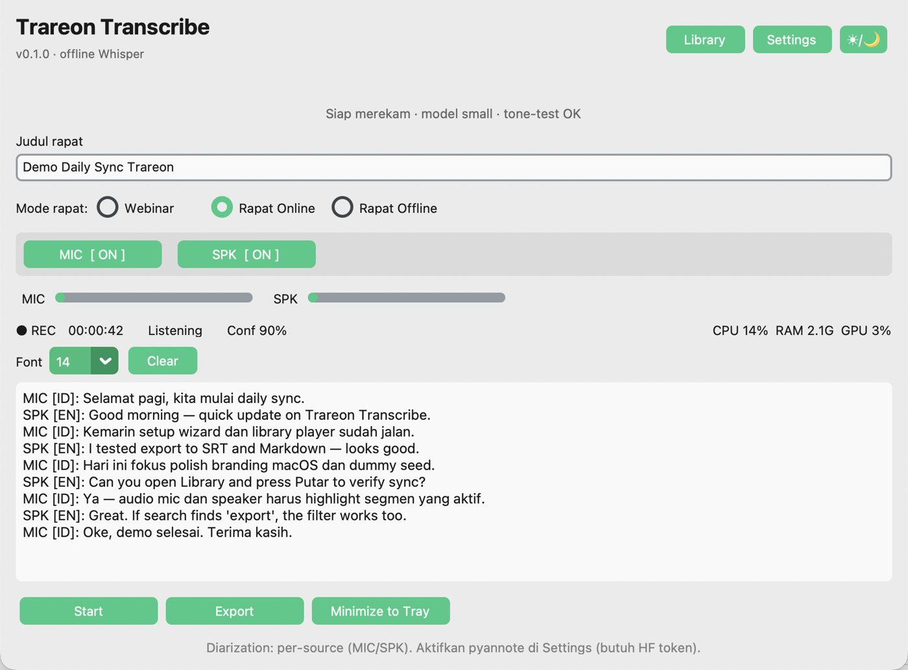
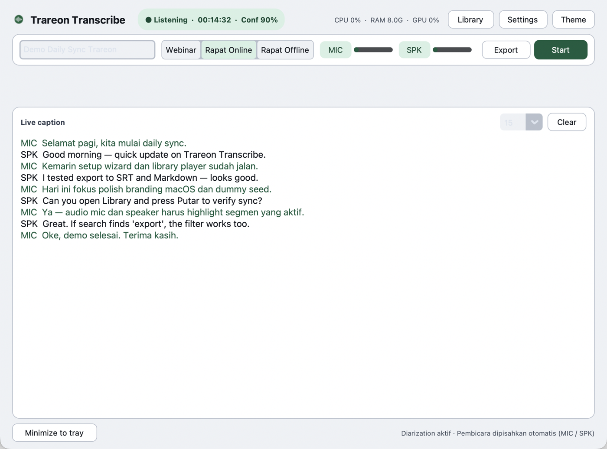
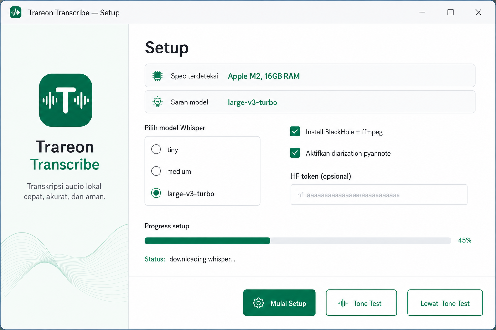
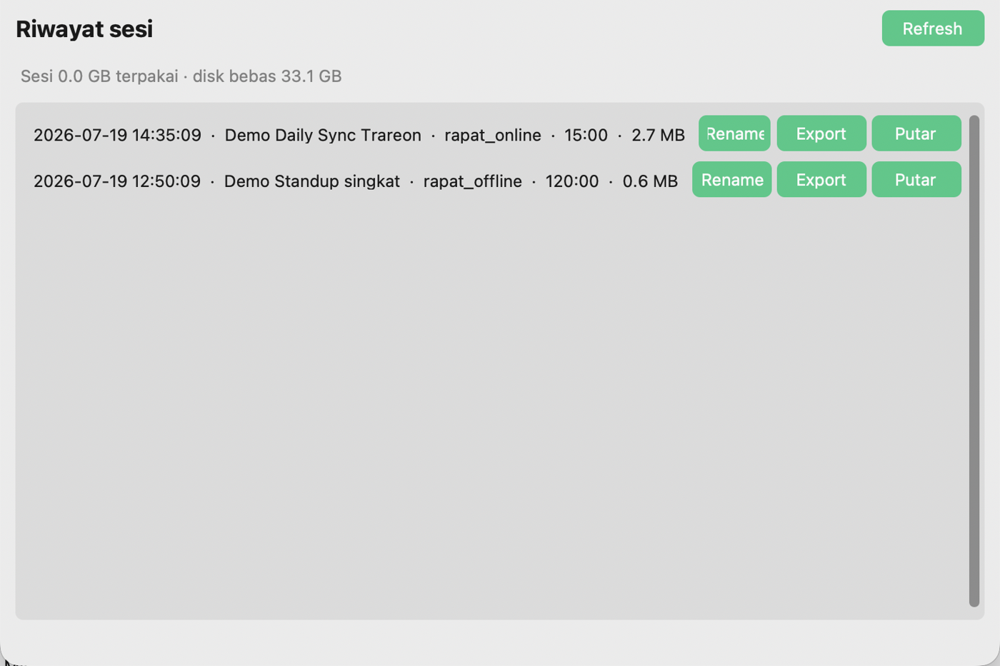
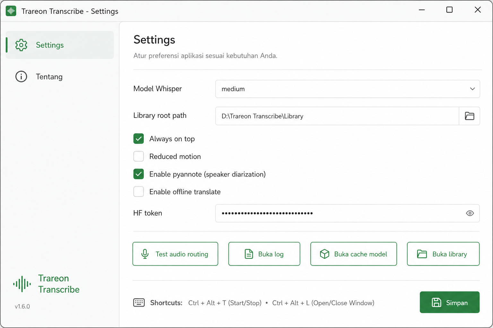
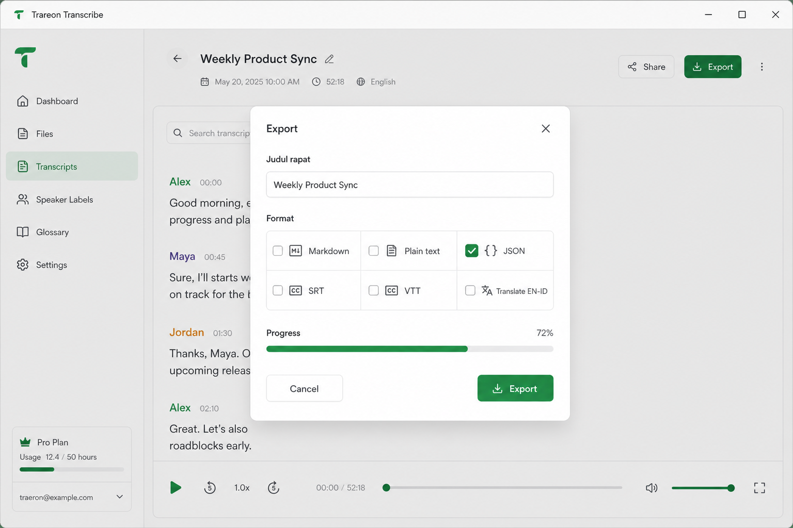

# Trareon Transcribe

Aplikasi desktop untuk **live transcription offline** — merekam & mentranskrip mikrofon + suara speaker (system audio) secara real-time. Cocok untuk webinar, rapat Zoom/Meet/Teams, dan rapat offline.

**Platform:** macOS (Apple Silicon + Intel) & Windows 11  
**Stack:** Python 3.11 · CustomTkinter · whisper.cpp · PyInstaller  
**Privasi:** audio & teks tidak dikirim ke cloud (inferensi lokal)

---

## Screenshots & fitur

### Jendela utama (Light mode)



- **Judul rapat** — isi/edit kapan saja (prefill dari judul Zoom/Meet jika terdeteksi)
- **3 mode rapat** — Webinar / Rapat Online / Rapat Offline (preset mic & speaker)
- **Toggle MIC / SPK** independen saat merekam
- **Live caption** dengan label sumber (`MIC` / `SPK`) dan bahasa (`[ID]` / `[EN]`)
- Status pipeline: Listening · Transcribing · Paused · Device error
- Monitor **CPU / RAM / GPU**, timer rekaman, minimize ke tray

### Dark mode



Toggle tema ☀/🌙 di pojok kanan atas; pilihan tersimpan antar sesi.

### Setup wizard (first run)



Wizard mendeteksi spek laptop, menyarankan model Whisper, memasang dependency (BlackHole/ffmpeg bila memungkinkan), mengunduh model + binary, opsional HF token, dan **tone-test** routing audio.

### Library sesi



Riwayat rekaman: **Putar** membuka viewer dengan audio + transcript tersinkron (speaker, waktu, teks apa adanya — tanpa translate), export ulang, rename, buka folder, hapus.

### Settings



Model, path library, always-on-top, reduced motion, pyannote, translate offline, HF token (keyring), tone-test, buka log/cache/library.

### Export



Pilih format: Markdown, TXT, JSON, SRT, VTT (+ opsional translate EN↔ID). File ditulis ke folder sesi.

---

## Fitur utama

| Fitur | Keterangan |
|--------|------------|
| Offline STT | whisper.cpp (ggml): `tiny` / `medium` / `large-v3-turbo` |
| Dual stream | Mic + speaker/loopback paralel |
| 3 mode | Webinar (spk), Rapat Online (mic+spk+echo-dedupe), Rapat Offline (mic) |
| Dual VAD | WebRTC + Silero (filter noise) |
| Echo-dedupe | Cegah duplikasi suara user di Rapat Online |
| Diarization | Default per-source MIC/SPK; opsional pyannote Speaker 1..N |
| Crash-safe | Autosave ~10 detik + resume sesi incomplete |
| Tone-test | Verifikasi routing BlackHole / VB-Cable |
| Single-instance | Satu proses app saja |
| Library player | Putar ulang mic/speaker WAV + highlight segmen transcript (speaker · waktu · teks) |
| Export | WAV per-track + MD / TXT / JSON / SRT / VTT |

---

## Panduan penggunaan

### 1. Install & jalankan (developer)

**macOS (Homebrew):** Python perlu paket Tk terpisah:

```bash
brew install python@3.11 python-tk@3.11
```

```bash
git clone https://github.com/Trareon-com/Trareon-Transcribe.git
cd Trareon-Transcribe
python3.11 -m venv .venv
source .venv/bin/activate          # Windows: .venv\Scripts\activate
pip install -r requirements.txt
python main.py
```

**macOS (nama + icon di Dock):** setelah venv siap:

```bash
chmod +x scripts/run_mac_app.sh
./scripts/run_mac_app.sh
```

Ini membuka `dist-run/TrareonTranscribe.app` (menu bar: “Trareon Transcribe”, bukan “Python”).

**Demo dengan data dummy** (Library + player + caption, tanpa rekaman live):

```bash
./scripts/run_mac_app.sh --demo
# atau: python scripts/seed_dummy_session.py --force
```

Sesi contoh ada di `~/Documents/Trareon Transcribe/Sessions/*-demo-seed` — di app: Library → **Putar** / **Export**.

Untuk development + tes:

```bash
pip install -r requirements-dev.txt
pytest -q
```

### 2. First-run wizard

1. Biarkan app mendeteksi RAM/CPU dan sarankan model.
2. Centang install **BlackHole + ffmpeg** (macOS / Homebrew) atau ikuti panduan VB-Cable (Windows).
3. Unduh model Whisper pilihan Anda (butuh ruang disk cukup).
4. Jalankan **Tone Test** — nada pendek harus terdengar di speaker capture.
5. (Opsional) tempel Hugging Face token untuk pyannote → disimpan di OS keyring.
6. Klik **Lanjut ke App**.

### 3. Routing audio (penting)

**macOS**

1. Install [BlackHole 2ch](https://existential.audio/blackhole/) (`brew install --cask blackhole-2ch`).
2. Buka **Audio MIDI Setup** → buat **Multi-Output Device** (Speaker bawaan + BlackHole).
3. Set Multi-Output sebagai output sistem (atau output Zoom).
4. Di Trareon, pastikan input speaker = BlackHole → jalankan Tone Test.

**Windows**

1. Install [VB-Audio Virtual Cable](https://vb-audio.com/Cable/).
2. Arahkan output meeting ke VB-Cable / gunakan WASAPI loopback.
3. Jalankan **Settings → Test audio routing**.

### 4. Alur rekam sehari-hari

1. Isi **Judul rapat** (atau biarkan auto-detect).
2. Pilih mode:
   - **Webinar** — hanya mendengar (speaker ON, mic OFF)
   - **Rapat Online** — mic + speaker + echo-dedupe
   - **Rapat Offline** — hanya mic ruangan
3. Override MIC/SPK kapan saja dengan tombol atau shortcut.
4. **Start** → caption muncul live (partial abu-abu → final solid).
5. **Stop** (konfirmasi) → folder sesi difinalisasi di Documents.
6. **Export** → pilih format → buka folder hasil.
7. Saat share screen Zoom: **Minimize to Tray** — transkrip tetap jalan.

### 5. Library & resume

- **Library** menampilkan semua sesi di folder Sessions.
- Jika app crash, saat dibuka lagi muncul dialog **Lanjutkan / Buang** sesi `.inprogress`.

### 6. Shortcut keyboard

| Key | Aksi |
|-----|------|
| `Space` | Start / Stop |
| `M` | Toggle mikrofon |
| `S` | Toggle speaker |
| `E` | Export |
| `T` | Minimize to tray |
| `,` | Settings |

---

## Penyimpanan file

| Jenis | macOS | Windows |
|--------|--------|---------|
| Config, lock, logs | `~/Library/Application Support/TrareonTranscribe/` | `%LOCALAPPDATA%\TrareonTranscribe\` |
| Model + whisper-cli | `~/Library/Caches/TrareonTranscribe/models/` | `%LOCALAPPDATA%\TrareonTranscribe\Cache\models\` |
| **Library sesi** (default) | `~/Documents/Trareon Transcribe/Sessions/` | `%USERPROFILE%\Documents\Trareon Transcribe\Sessions\` |

Struktur satu sesi:

```
YYYYMMDD-judul-uuid/
├── meta.json           # judul, mode, durasi, device
├── transcript.json     # source of truth
├── mic.wav             # track mikrofon
├── speaker.wav         # track speaker/loopback
├── .inprogress         # ada = sesi belum selesai
├── transcript.md       # saat export
├── transcript.txt
├── transcript.srt      # opsional
└── transcript.vtt      # opsional
```

Path library bisa diganti di **Settings**.

---

## Build executable

```bash
pip install -r requirements.txt
./scripts/build.sh
# atau:
pyinstaller --noconfirm --clean packaging/trareon-transcribe.spec
```

Hasil: `dist/Trareon Transcribe` (macOS) / `.exe` (Windows).  
Release GitHub Actions juga menghasilkan CycloneDX SBOM.

> Code signing / notarization memerlukan sertifikat organisasi (di luar repo).

---

## Privasi & keamanan

- Tidak ada telemetri / analytics.
- Runtime transkripsi **offline**; unduhan hanya saat setup/model.
- HF token di **keyring**, bukan `config.json`.
- Lihat [SECURITY.md](SECURITY.md).
- CI: ruff · bandit · pytest · pip-audit · gitleaks.

---

## Struktur proyek

```
main.py                 # entrypoint + single-instance
engine/                 # audio, VAD, STT, dedupe, session, tone-test, diarization
ui/                     # main, wizard, settings, library, export, tray
export/                 # naming + writers
setup/                  # deps, disk check, model download
config/                 # paths, settings, keyring, lock
docs/                   # design + screenshots
tests/
.github/workflows/      # CI + release
```

Design lengkap: [docs/design.md](docs/design.md)

---

## Troubleshooting singkat

| Masalah | Coba |
|---------|------|
| `No module named '_tkinter'` | macOS: `brew install python-tk@3.11`, lalu buat ulang venv (`rm -rf .venv && python3.11 -m venv .venv && pip install -r requirements.txt`) |
| App tidak muncul / langsung tutup | Hapus lock basi: `rm -f ~/Library/Application\ Support/TrareonTranscribe/instance.lock` lalu `./scripts/run_mac_app.sh` |
| Crash SIGABRT / `RegisterApplication` | Jangan panggil AppKit sebelum Tk. Jalankan dari Terminal.app atau `./scripts/run_mac_app.sh` (bukan selalu dari terminal Cursor) |
| Menu bar / Dock / dialog izin mic bertuliskan Python | Jalankan via `./scripts/run_mac_app.sh` (bukan `python main.py`). Dialog izin macOS mengikuti bundle `.app`. Jika dulu sudah grant ke «Python», buka System Settings → Privacy → Microphone → aktifkan **Trareon Transcribe**. Butuh `pyobjc-framework-Cocoa` di venv. |
| Caption kosong | Pastikan MIC/SPK ON sesuai mode; cek izin Mikrofon OS |
| Speaker tidak ter-transkrip | Tone Test gagal → perbaiki Multi-Output / VB-Cable |
| `[STT: model/binary belum…]` | Jalankan ulang wizard / unduh model ke folder cache |
| App “sudah berjalan” | Tutup instance lain / cek system tray |
| Disk penuh | Kurangi model (`tiny`/`medium`) atau kosongkan ruang |

---

## Kontribusi

1. Fork & branch dari `main`
2. `pip install -r requirements-dev.txt && pre-commit install`
3. `pytest -q && ruff check .`
4. Buka PR (lihat template security checklist)

---

## License

Lihat [LICENSE](LICENSE).
