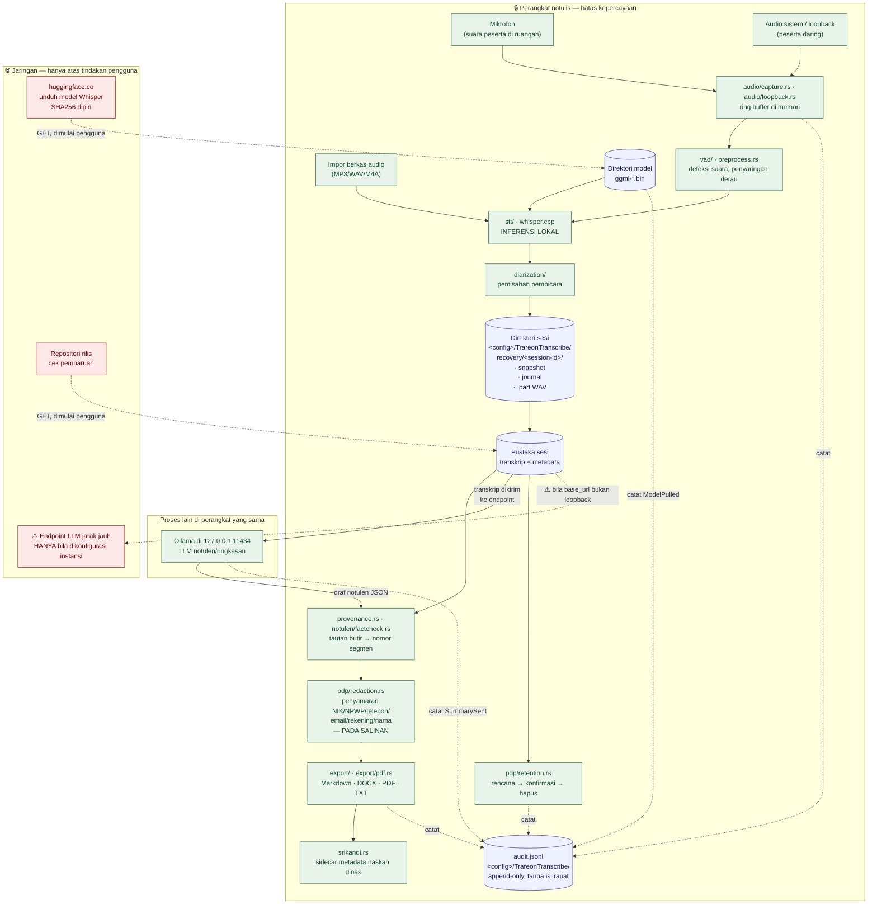

# Alur Data Trareon Transcribe

Dokumen ini menjawab satu pertanyaan yang selalu muncul di asesmen
kepatuhan: **data rapat ada di mana, pindah ke mana, dan lewat apa.**

> Semua pernyataan di sini merujuk ke berkas sumber agar dapat diperiksa.
> Konfigurasi yang diasumsikan adalah **konfigurasi baku**; perubahan
> konfigurasi yang mengubah alur disebut eksplisit di §3.

---

## 1. Diagram alur data



### Cara membaca diagram

- **Garis penuh** = aliran data rapat.
- **Garis putus-putus** = pencatatan ke log audit, atau lalu lintas
  jaringan yang dimulai pengguna.
- **Kotak hijau** = pemrosesan lokal di perangkat.
- **Kotak biru** = penyimpanan persisten.
- **Kotak merah** = di luar perangkat.

Yang perlu diperhatikan: **tidak ada garis penuh** dari kotak hijau mana
pun ke kotak merah pada konfigurasi baku. Satu-satunya jalur data rapat ke
luar perangkat adalah panah `⚠️` yang hanya ada bila instansi mengubah
`base_url` endpoint LLM menjadi bukan loopback.

---

## 2. Inventaris aset data

| Aset | Lokasi | Isi data pribadi? | Dibuat oleh | Dihapus oleh |
|------|--------|-------------------|-------------|--------------|
| Audio tangkapan (`.part` WAV) | `<config>/TrareonTranscribe/recovery/<session-id>/` | **Ya — suara, berpotensi karakteristik biometrik** | `audio/capture.rs`, `audio/loopback.rs` | Retensi (jam audio) atau hapus sesi |
| Snapshot + journal sesi | direktori sesi yang sama | **Ya** — teks transkrip | `session.rs`, `journal.rs` | Retensi (jam transkrip) atau hapus sesi |
| Transkrip + metadata Pustaka | Pustaka sesi | **Ya** — teks, nama pembicara | `session.rs` | Hapus sesi |
| Catatan pribadi notulis | metadata sesi | **Ya**, bila notulis menulisnya | UI | Hapus sesi |
| Glosarium | konfigurasi | Mungkin — bila memuat nama orang | `glossary.rs` | Pengguna |
| Daftar nama untuk disamarkan | konfigurasi PDP | **Ya** — nama yang sengaja dimasukkan | UI PDP | Pengguna |
| `audit.jsonl` | `<config>/TrareonTranscribe/` | **Tidak memuat isi rapat**; memuat judul/jalur sesi dan tujuan ekspor | `pdp/audit.rs` | **Tidak dihapus oleh aplikasi** — tidak ada rotasi, tidak ada API hapus |
| Berkas ekspor (MD/DOCX/PDF/TXT) | lokasi yang dipilih pengguna | **Ya** (disamarkan bila Mode PDP aktif) | `export/` | Pengguna, di luar aplikasi |
| Sidecar SRIKANDI | di samping berkas ekspor | Metadata naskah dinas; dapat memuat nama pejabat | `srikandi.rs` | Pengguna |
| Model Whisper (`ggml-*.bin`) | direktori model (lihat §4) | Tidak | `model.rs` | Pengguna |
| Model LLM (Ollama) | penyimpanan Ollama, **di luar kendali Trareon** | Tidak | Ollama | Pengguna via Ollama |

Catatan penting untuk DPIA: **`audit.jsonl` tidak ikut terhapus** ketika
sesi dihapus. Itu memang tujuannya — log audit yang bisa dihapus bersama
data yang diaudit tidak menjawab pertanyaan apa pun — tetapi berarti
jalur/judul sesi yang sudah dihapus tetap tercatat. Bila judul rapat
sendiri sensitif, instansi perlu memperhitungkannya.

---

## 3. Titik keluar jaringan — daftar lengkap

Didokumentasikan di `lib/state/privacy_report_model.dart:5-24` dan
ditegakkan oleh `rust_core/src/privacy.rs` serta
`test/privacy_proof_test.dart`.

| # | Titik | Tujuan | Kapan | Data apa yang keluar | Tercatat di |
|---|-------|--------|-------|----------------------|-------------|
| 1 | Unduh model Whisper | `huggingface.co/ggerganov/whisper.cpp` | Onboarding atau dialog model, atas klik pengguna | **Tidak ada data rapat.** Permintaan GET untuk berkas model; SHA256 dipin di `model.rs` dan diverifikasi setelah unduh | Laporan Privasi, `audit.jsonl` (`ModelPulled`) |
| 2 | Ringkasan/notulen AI | `base_url` endpoint — **baku loopback** `http://localhost:11434` | Atas klik pengguna per permintaan; mati secara baku | **Transkrip bernomor** dikirim ke endpoint. Pada konfigurasi baku endpoint berada di perangkat yang sama, jadi tidak ada data yang meninggalkan perangkat | Laporan Privasi, `audit.jsonl` (`SummarySent`) |
| 3 | Cek pembaruan | `raw.githubusercontent.com` — satu berkas `VERSION` (`lib/app_version.dart:24`) | Atas klik "Cek Pembaruan" | **Tidak ada data rapat.** GET satu berkas teks berisi nomor versi | Laporan Privasi |
| 4 | Buka halaman rilis | peramban pengguna | Atas klik tautan | Tidak ada | Laporan Privasi |
| 5 | Tanya arsip rapat | endpoint yang sama dengan #2 | Atas pertanyaan pengguna | **Hanya petikan yang diambil secara lokal** dikirim, bukan seluruh arsip | Laporan Privasi |

Tidak ada telemetri, tidak ada analitik, tidak ada pelaporan galat jarak
jauh, tidak ada akun, dan tidak ada sinkronisasi. Yang membuat ini bisa
diperiksa bukan daftar ini melainkan uji di `privacy.rs`: daftar yang
tidak sesuai kode akan menggagalkan build.

> **Mengapa layar Laporan Privasi menyebut *empat*, bukan lima.** Layar di
> dalam aplikasi melipat baris 5 ke dalam baris 2, karena keduanya adalah
> endpoint yang sama dan pengguna mengaturnya di satu tempat. Tabel ini
> memisahkannya karena pemicunya berbeda — satu dari tombol "Buat
> Ringkasan/Notulen", satu dari "Tanya arsip rapat" — dan asesmen perlu
> tahu keduanya. Tidak ada titik keluar yang hilang dari salah satu
> daftar.

### Pemeriksaan mandiri untuk auditor

```sh
# 1. Gerbang luring, sisi Rust — gagal bila jalur transkripsi menyentuh jaringan
cd rust_core && cargo test --lib privacy

# 2. Gerbang luring, sisi Dart
flutter test test/privacy_proof_test.dart

# 3. Daftar seluruh literal URL di seluruh kode mesin
grep -rn "https\?://" rust_core/src/ --include=*.rs

# 4. Pemeriksaan runtime: jalankan aplikasi, transkripsikan satu berkas,
#    lihat Pengaturan → Laporan Privasi. Hitungan panggilan jaringan
#    harus tetap 0 sepanjang transkripsi.
```

Langkah 3 akan memperlihatkan URL di `model.rs` (unduh model), `summary.rs`
(endpoint ringkasan), dan `llm_setup.rs` (**teks instruksi** tempat
mengunduh Ollama — bukan permintaan; dijaga uji
`the_setup_module_names_urls_only_as_instructions`).

---

## 4. Lokasi penyimpanan per sistem operasi

| OS | Direktori konfigurasi (sesi, log audit) | Direktori model |
|----|------------------------------------------|-----------------|
| Linux | `~/.config/TrareonTranscribe/` | direktori Pustaka, `~/Library/Caches/TrareonTranscribe/models/`, atau `models/` di samping berkas eksekusi |
| Windows | `%APPDATA%\TrareonTranscribe\` | `%LOCALAPPDATA%\TrareonTranscribe\models\` atau `models\` di samping `.exe` |
| macOS | `~/Library/Application Support/TrareonTranscribe/` | `~/Library/Caches/TrareonTranscribe/models/` atau `Contents/Resources/models` di dalam bundel |

Sumber: `rust_core/src/session.rs:1118` (direktori pemulihan),
`rust_core/src/pdp/audit.rs:181` (log audit),
`rust_core/src/model.rs:264-288` (pencarian model).

Direktori konfigurasi dipilih, bukan direktori temp, dengan alasan yang
tercatat di `session.rs:1113`: direktori ini memuat teks transkrip dan
audio, sehingga `/tmp` yang dapat dibaca semua pengguna akan menjadi
kemunduran privasi.

### Implikasi untuk cadangan

Pada ketiga sistem operasi, direktori konfigurasi **ikut tercakup**
mekanisme cadangan baku (Time Machine, File History, agen cadangan
korporat). Artinya: menghapus sesi di Trareon **tidak** menghapus salinan
di cadangan. Ini kesenjangan G-5 di `PEMETAAN-UU-PDP-27-2022.md` dan harus
ditangani prosedur instansi (`PROSEDUR-RETENSI-DAN-PENGHAPUSAN.md` §5).

---

## 5. Alur satu rapat, berurutan

1. Notulis menempelkan **teks pemberitahuan perekaman** ke obrolan rapat
   (bila Mode Kepatuhan PDP aktif, aplikasi mengingatkan sebelum merekam).
   → `audit.jsonl`: `ConsentAcknowledged`
2. Perekaman dimulai. Audio masuk ring buffer di memori, ditulis berkala
   sebagai `.part` WAV ke direktori sesi (penulisan atomik: temp + rename).
   → `audit.jsonl`: `SessionCreated`
3. VAD memilih potongan berisi suara; whisper.cpp mentranskripsi **di
   perangkat**; diarization memberi label pembicara.
4. Notulis menyunting transkrip dan nama pembicara.
5. *(Opsional)* Notulis menekan "Buat notulen". Transkrip bernomor dikirim
   ke endpoint LLM — pada konfigurasi baku, Ollama di `127.0.0.1`. Draf
   JSON kembali, diperiksa `factcheck.rs` terhadap transkrip, butir yang
   tidak didukung ditandai.
   → `audit.jsonl`: `SummarySent`
6. Notulis menyetujui atau memperbaiki setiap butir di formulir notulen.
7. Ekspor. Bila Mode PDP aktif, penyamaran berjalan **pada salinan**;
   transkrip tersimpan tidak berubah. Sidecar SRIKANDI ditulis bila
   diminta.
   → `audit.jsonl`: `RedactionApplied`, `SessionExported`
8. Pada jadwal retensi instansi, notulis atau admin membuka Pengaturan →
   Kepatuhan PDP → Retensi → "Lihat & jalankan sekarang", memeriksa
   daftar, dan mengonfirmasi.
   → `audit.jsonl`: `AudioDeleted` / `TranscriptDeleted` / `RetentionApplied`

Langkah 5 adalah satu-satunya langkah yang mengirim isi rapat ke luar
proses Trareon, dan langkah 8 adalah satu-satunya langkah yang menghapus.
Keduanya memerlukan tindakan pengguna yang eksplisit.

---

*Disusun 7 Oktober 2026 · Trareon Transcribe Sprint 7*
